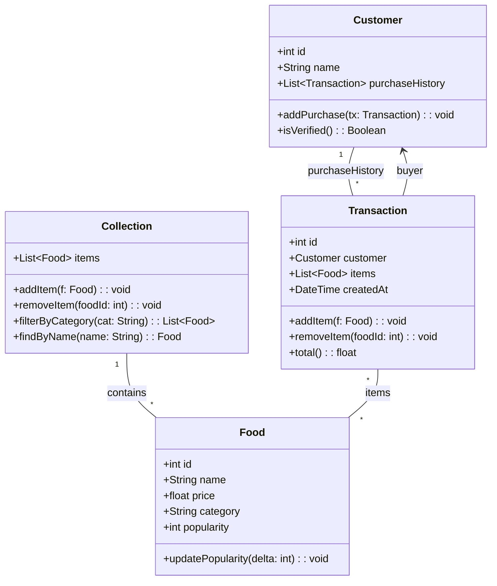

%% ByteBites UML - Mermaid class diagram

```mermaid
classDiagram
    class Customer {
        +int id
        +String name
        +List~Transaction~ purchaseHistory
        +addPurchase(tx: Transaction): void
        +isVerified(): Boolean
    }

    class Food {
        +int id
        +String name
        +float price
        +String category
        +int popularity
        +updatePopularity(delta: int): void
    }

    class Collection {
        +List~Food~ items
        +addItem(f: Food): void
        +removeItem(foodId: int): void
        +filterByCategory(cat: String): List~Food~
        +findByName(name: String): Food
    }

    class Transaction {
        +int id
        +Customer customer
        +List~Food~ items
        +DateTime createdAt
        +addItem(f: Food): void
        +removeItem(foodId: int): void
        +total(): float
    }

    Customer "1" -- "*" Transaction : purchaseHistory
    Collection "1" -- "*" Food : contains
    Transaction "*" -- "*" Food : items
    Transaction --> Customer : buyer
```